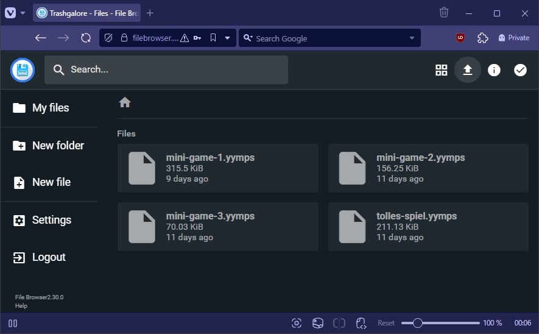

# Trash Galore 3 - Der Leitfaden

Damit du dich auf die Entwicklung deines Spiels konzentrieren kannst habe ich mir Mühe gegeben, das Drumherum möglichst einfach zu gestalten. Ein paar Dinge gibt es trotzdem zu beachten, die ich im Folgenden kurz anspreche.

# Constraints
* Die Auflösung ist 640 x 360. Der Launcher bietet die Möglichkeit x2 und x3 zu vergrößern.
* Bitte kennzeichne alle Ressourcen mit einem Präfix, wie `obj_abc_enemy` oder `spr_abc_apple` damit diese eindeutig sind. Das gilt auch für globale Variablen und Funktionen sowie Structs die in Scripts definiert werden.

# Development Package
Es gibt ein Package, das du zur Entwicklung importieren musst. Du kannst es [hier](TODO) herunterladen. Im GameMaker kannst du es über `Tools -> Import Local Package` importieren.
Es enthält folgende Dateien:

## scr_api.gml

Stellt die Api bereit, um mit dem Launcher zu kommunizieren.
Die funktionen lassen sich über `API.` aufrufen und sind über JSDoc dokumentiert. Der GameMaker zeigt dir also an, wie die Funktionen zu nutzen sind.

Beispiel:
```javascript
API.unlock_achievement("abc_great_success");
```

### Steuerung
Über die Api können wir auch die Steuerung vereinheitlichen, sodass im besten Fall auch Controller-Support mitgeliefert wird. Nutze dafür gerne die mitgelieferten Funktionen, auch wenn dies streng optional ist:

Beispiele:
```javascript
API.action_check_pressed(INPUT_ACTION.UI_NAVIGATE_UP);
API.action_check_released(INPUT_ACTION.MOVE_UP);
API.action_check(INPUT_ACTION.ACTION_PRIMARY);
```

### Audio
Die Musik- und Sound-Lautstärke lässt sich im Launcher einstellen.
Wenn du Sounds abspielst, kann du über die API einfach auf die Lautstärke zugreifen:

```
audio_play_sound(bgm_abc_ambient, 1, false, API.audio_get_music_volume());
audio_play_sound(snd_abc_crash, 1, false, API.audio_get_sound_volume());
```

Alternativ kannst du über `Tools -> Audio Groups` die Gruppen `audio_music` und `audio_sounds` hinzufügen und deine Musik / Sounds diesen Gruppen zuordnen. Dann wird die Lautstärke auch ohne Code angepasst.


## game.json
Die `game.json` landet in den "Included Files". Im Projektverzeichnis entspricht das dem `datafiles` Ordner.

Die `game.json` enthält alle notwendigen Metadaten, damit dein Spiel später richtig im Launcher angezeigt wird:

```json
{
    "name": "Name des Spiels",
    "author": "Dein Name",
    "description": "Eine kurze Beschreibung deines Spiels",
    "start_room": "room_moo_game_00", // Der Raum, den der Launcher aufrufen soll
    "images": ["spr_moo_thumb_00"], // Screenshots deines Spiels, die im Launcher angezeigt werden sollen. AUFLÖSUNG: 640 x 360
    "achievements": [
        {
            "id": "aa_legendary",
            "name": "Legendary Status",
            "description": "Achieve a level of greatness that is truly legendary!",
            "hidden": true // Optionaler parameter. Versteckt das Achievement in der Liste der Achievements.
        },
        {
            "id": "aa_treasure_hunter",
            "name": "Treasure Hunter",
            "description": "Uncover all hidden treasures in the game!",
            "image": "spr_moo_achievement_icon_paint" // Optionaler Parameter: Ein Icon, das im Launcher zusammen mit dem Achievement angezeigt wird. AUFLÖSUNG: 32 x 32
        }
    ]
}
```

# Deployment

## Export
Um das Spiel in den Launcher zu integrieren musst du es bitte über `Tools -> Create Local Package` exportieren. ❗ Bitte achte nochmal darauf, dass alle Ressourcen mit Präfixen versehen sind.

Hinten raus kommt eine `.yymps`-Datei.

## Upload

Lade die `.yymps`-Datei jederzeit auf [https://filebrowser.moolt.de](https://filebrowser.moolt.de) hoch.

Die Zugangsdaten sind:

| Nutzername  | Passwort                      |
| ----------- | ----------------------------- |
| trashgalore | NWa<Ap2QQFy7>L9Uwb9uSmpY>     |



Zum Ersetzen klappt am Besten Drag & Drop.

Durch den Upload wird ein GitHub-Workflow angestoßen, der automatisch den Launcher mit deinem Spiel für Linux, Windows und HTML5 baut. Falls du zum GitHub-Repository eingeladen werden möchtest, melde dich gerne bei mir (Moolt).

TODO: (esc) overlay, esc reserviert!